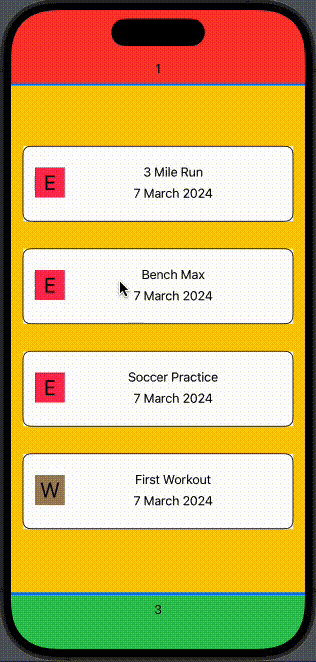

# **Trophy**

## **What is Trophy?**

Trophy is an app that allows user to flexibly customize their unique exercises for the best possible insight into their fitness goals. This app reverses the idea that other fitness tracking applications follow — requiring the user to follow data input guidelines, instead of the user providing any form of exercise data to the app.

Example Use Cases:
* Let's say you are a runner preparing for a competitive 5k. Other fitness tracking apps might track data like distance and time. However, you're curious to also track how much effort you put into each run, so that you can better understand how much effort it takes to run a certain time/distance. Trophy allows the standard tracking of distance and time, in addition to allowing you to choose an Intensity attribute, measured as either low, medium, or high. This combination gives you the ability to better understand how your runs truly vary for one another, ultimately giving you deeper insight to your fitness goals.
  
* Take an example where you are learning to climb at your local bouldering gym, and you would like to check your progress for a certain climb/beta. Trophy allows you to create your named exercise and choose to track attributes such as Time and Level (measured 0-10). This combination of exercise attributes allows you to better understand the progress of your specific climb over time.

## **Section 0** - _Backend Model + UI Design_

### Intro
In this section, I focused on designing the fitness application before diving straight into any form of development.
I leveraged tools such as Figma and draw.io to flesh out my Frontend UI and Backend relationships 

I implemented key skills such as: 
- Software Architecure Design (MVVM)
- UML Diagraming
- Model Design
- View Design
- ViewModel Design 

## **Section 1** - _MVVM Implementation + Unit Testing_
### Intro
In this section, I focused on the actual Backend implementation and testing of the MVVM architecture, allowing me to create complex and strong data structures, using Software Engineering best practices and skills.

Best practices and skills such as:
- Separation of Responsibility
- Principle of Least Privilege
- MVVM
- Unit Testing
- Inheritance
- Object-Oriented Programming
- SwiftUI
- Xcode
- Factory Design
- Singleton Design
- Test Driven Development
- Software Engineering
- Git
- Linux

Below is a demo showing off the progress at Section 1

| Demo | Demo Content |
| --- | --- |
|  | This demo shows off our main ContentView (i.e. Homepage), an Exercise Summary Modal, and how Exercises with different attributes will be displayed according to the attributes they possess (e.g. Distance)|

## **Section 2** - _Dynamic Content + Improved UI_
### Intro
In this section, I focused on two topics. 
Firstly, allowing the user the ability to dynamically add Exercises in a UI friendly way. This key feature being implemented allowed absolute flexibility in the Exercise the user would want to create.
Secondly, practicing good UI design through the use of the Coolors.co website for developing proper Color Sets to use within my application.  

Skills Implemented in this Section Include:
- State Management
- Database Management
- Dynamic Content
- Component Design
- Color Sets
- User Input
- Event Handling
- Framework Development

| Demo | Demo Content |
| -------------------- | ----- |
| [Link to Video Demo](https://drive.google.com/file/d/1XLULtfyo_SGpCxH-LduXSWSue9_EKtpH/view?usp=sharing) | This demo not only continues to show off the progress in our ContentView and Exercise Summary Modal, but it demos the user's new ability to add custom Exercises via User Input. This is where the power of the application truly starts to shine|

## **Section 3** - _AWS API Gateway Integration_
### Intro
In this section, I set out to accomplish one goal: Connecting my iOS application to my TrophyRESTAPI hosted in AWS API Gateway.
I approached this by breaking my goal into subgoals:
1. Understand the relationship between iOS and API Gateway
2. Implement a basic API with mock integration typing, so that my application could have API Endpoints to call 
3. Integrate the iOS SDK generated by API Gateway with my iOS application
4. Test that my application was able to call a test TrophyRESTAPI function without failure

**Step 1**
* To understand the relationship between iOS and API Gateway, I followed the official documentation on how to [Use iOS SDK generated by API Gateway for a REST API in Objective-C or Swift](https://docs.aws.amazon.com/apigateway/latest/developerguide/how-to-generate-sdk-ios.html).

**Step 2**
* To implement best practices through hands-on experience, I followed an [official AWS tutorial](https://docs.aws.amazon.com/apigateway/latest/developerguide/simple-calc-lambda-api.html).

**Step 3**
* During this step, I installed the iOS SDK using [Cocoapods](https://cocoapods.org/).
* During my Integration Testing, I found that one of my targets (TrophyTests) was unable to access the Pods that were used by Trophy, which would have allowed for my application to make RESTful API calls to my API. This became a brick wall that temporarily halted my development, as I researched for solutions for the error: 'AWSApiGatewayBridge.h' file not found".

* The odd part was that the application would build without any errors, so I narrowed it down to some form of access control issue.
* If the 'file not found' error was my brick wall, Cocoapod's Abstract Targets were my sledgehammer. Implementing the abstract\_target standard practice allowed me to group my targets together, so they both had access to the same Pods that were needed. 

**Step 4**
* With the heavy lifting out of the way, all that was left to do was to ensure that my TrophyRESTAPI client would successfully be able to make a call to the TrophyRESTAPI test function without receiving any errors in return.
* Fortunately, by mirroring the [iOS API Gateway Developer Guide](https://docs.aws.amazon.com/apigateway/latest/developerguide/how-to-generate-sdk-ios-swift.html), I was able to successfully integrate my application with the TrophyRESTAPI.

Skills Implemented in this Section Include:
- AWS API Gateway
- RESTful API
- API Integration
- API Endpoints
- CocoaPods
- iOS SDK for AWS
- Version Control
- Integration Testing
- API Integration Testing
- Dependency Management

## **Section 4** - _AWS Lambda Integration_
### Intro
In this section, I focused on establishing and testing the Request-Response relationship between 3 components:
1. Trophy iOS Application
2. AWS API Gateway
3. AWS Lambda

**Trophy ==> API Gateway**
* Initiate a POST Request containing a payload for values _{a}_,_{b}_, and _{op}_ for API Gateway to route. 

**API Gateway ==> Lambda**
* Transform the request based on the configured integration settings and forward it to AWS Lambda.

**Lambda**
* Perform computations based off of request payload

|Lambda Function Overview|Lambda Test Event Response|
|--|--|
|  | |

**Lambda ==> API Gateway**
* Generate and return a Response based on the outcome of the execution and forward it to API Gateway

**API Gateway ==> Trophy**
* Transform the resposne based on the configured integration settings and forward it to Trophy

Skills Implemented in this Section:
- Serverless Architecture
- Event-Driven Programming
- RESTful APIs
- API Design
- API Gateway
- API Integration Testing
- API Deployment
- AWS Lambda
- AWS CloudWatch
- Metrics/Monitoring
- Node.js
- Postman

## **Section 5** - _TrophyRESTAPI Gateway + Lambda Function Development_
### Intro
This section is dedicated to outline the development of the primary CRUD functions that will be needed to allow a user to create, retreive, update, and delete Exercises. I broke this goal into 4 tasks:

1. **API Gateway Model Design**
    * With Lambda already integrated at a basic level, I could now flesh out a more complex Lambda function to take the next step in my development, but first, I would need to establish how I wanted my Lambda functions to receive Exercise data.
    * I designed and implemented 2 API Gateway Models. One for restricting the API caller's Method Request to a specific format, and another for restricting Lambda functions to a specific format for the Method Response.
    * This solved the dilemma for ensuring consistent data formatting.     

2. **Lambda & Layer Design**
    * My next task was to design the code that would operate as a data-processing facilitator to my RDS database tables.
    * My biggest obstacle here was answering the following questions:
        a) How do I ensure my CRUD functions remain modular/independent of one another?
        b) How can I avoid bloat in my code, such that I do as little duplication of code as reasonably possible?
        c) How can I do both of the prior, if my CRUD functions all share a need for connecting with the database, but I don't want to want to create a single Lambda function that handles all the CRUD operations? 
    * My solution was Lambda Layers. Layers allowed me to write code once and upload it via the Lambda console, and easily import the code into a single Lambda function. Layers answered my question such that:
        * Each CRUD function could operate independently
        * Coding Layer code such as database connections, CRUD functions, and validation code could be coded once and simply added to my Lambda function. If I needed to update the Layer code, I would only have to do it in one location, and I would only need to ensure I am using the latest version of my Layer!

3. **Lambda & Layer Development**
    * This section was fairly straightforward in the sense that I knew what my data looked like coming into Lambda, and I knew what my data needed to look like for storing the SQL tables.
    * The biggest concerns included: Security, QA-minded Development, and Developing "Bottom-Up" 
        * Security
            * Concern: Up to this point, I had been using Lambda environment variables to store DB credentials. However, that would be bad security practice and not scalable for the long term.
            * Solution: I integrated Secrets Manager, such that I retrieved my database credentials safely. This would also facilitate scalability, as future Lambda functions could simply reference that same Secret if needed.
        * QA-minded Development
            * Concern: As a former QA Engineer, I understand how much easier it can be when the code that you are testing:
                a) Is well commented (e.g. function comments)
                b) Error Handleds well (e.g. Custom error messages with detailed error response output)
            * Solution: As I developed, I ensured an ease of future debugging through:
                a) Function Comments
                    * I leverage OpenAI's ChatGPT to outline many function comments for me, saving me time and ensuring my functions' purpose were able to be quickly understand, and the requirements/parameters were specifically outline
                b) Error Handles
                    * Creating an Error file containg constant variables that would describe the issue found at a high level (e.g. ERROR_INVALID_JSON_FORMAT = "Invalid JSON format"). This helped me quickly narrow down on what the overall cause of the issue was.
                    * Creating several Validation functions that would output all Errors found during a JSON object's validation process. This cut down on filtering for reasons for why a function was not behaving as I intended.
        * Developing Bottom-Up:
            * Concern: In order to create an Exercise, a user would very likely use Exercise Attributes to describe features of their Exercise(e.g. Distance, Time, Weight). I wanted to develop in a manner such that if any bugs were found during development, they were easily managed
            * Solution: I developed and unit tested starting from the smallest form of data and worked my way up. 
                * I think of this structure as working in a binary tree, but starting from the bottom of the tree and working our way up breadth-wise.
                * This development process ensured that components needed from a parent component would be available during the parent's component development

4. **Test, Test, Test...**
    * In this task, I needed to validate edge cases, improper inputs, and various scenarios that could occur during the life of the app relating to Exercise CRUD operations
    * Create Exercise
        * Concerns: Ensuring that data entered by a user for an Exercise creation would be handled as expected.
        * Solutions: To ensure proper Creation, below are some scenarios tested
            * User creates an Exercise with all JSON properties filled
            * User creates an Exercise with no JSON properties filled
            * User creates an Exercise with no Exercise Attributes attached
            * User creates an Exercise with missing data required for database storage 

    * Retrieve Exercise
        * Concerns: Ensuring that data entered into the SQL table would be retrieved as expected from the user.
        * Solutions: To ensure proper Retrieval, below are some scenarios tested
            * User retrieves an Exercise with a valid exercise\_id
            * User retrieves an Exercise with an invalid exercise\_id
            * User retrieves an Exercise with valid NULL field values
            * User retrieves an Exercise with no NULL field values

    * Update Exercise
        * Concerns: Ensuring that data entered by a user for an Exercise update would be handled as expected.
        * Solutions: To ensure proper Updating, below are some scenarios tested
            * User updates an Exercise with completely new data
            * User updates an Exercise with the exact same data
            * User updates an Exercise from no Exercise Attributes with Exercise Attributes
            * User updates an Exercise from Exercise Attributes with Exercise Attributes
            * User updates an Exercise with missing data required for database storage
|  |  | 
 | 
    * Delete Exercise
        * Concerns: Ensuring that existing data deletes as expected
        * Solutions: To ensure proper Deletion, below are some scenarios tested
            * User deletes an Exercise with a valid exercise\_id
            * User deletes an Exercise with an invalid exercise_\id
            * User deletes an Exercise, all associated Exercise Attributes are Deleted
|  |  |

Skills Implemented in this Section:
- API Design
- API Gateway
- API Integration Testing
- AWS Lambda/Lambda Layers
- AWS CloudWatch
- AWS Secrets Manager
- Metrics/Monitoring
- Networks
- SQL/MySQL
- JavaScript
- Test-Driven Development/QA/Unit Testing
- Component Design
- Security Groups
- EC2
- VPC
